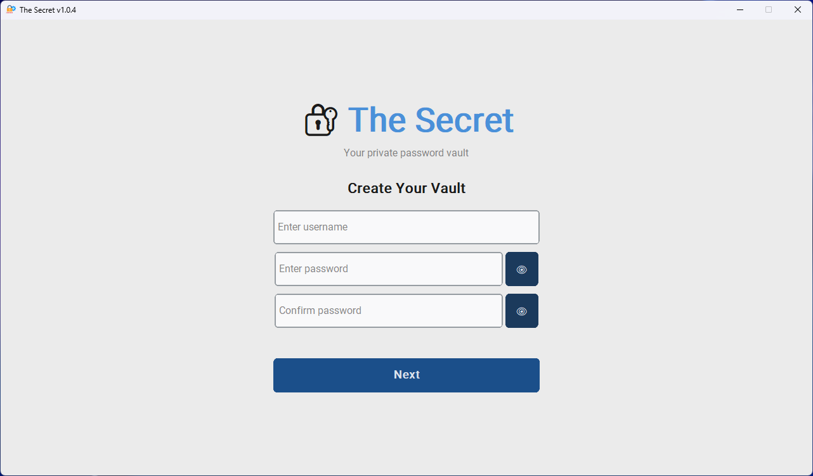
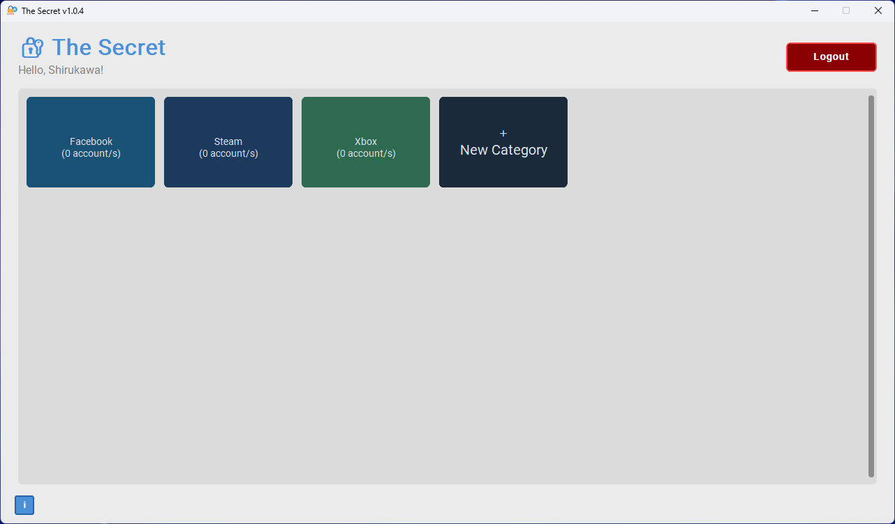
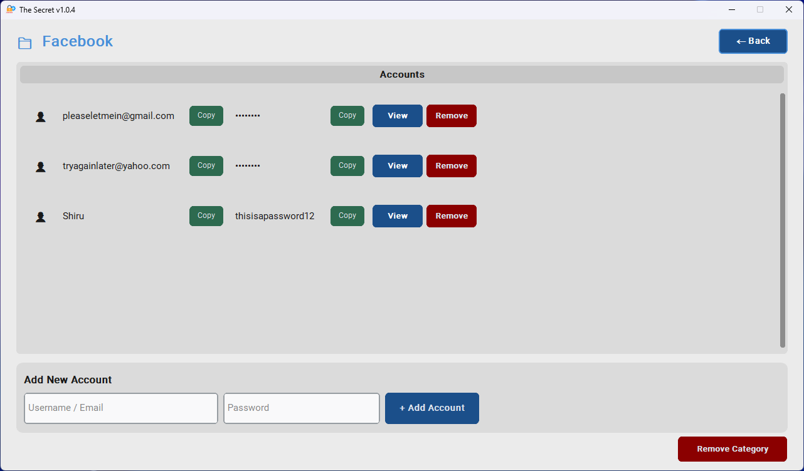

<h1 align="center">The Secret</h1>

  A secure, fully offline password manager built with Python.
   

  
  
  
  
  

## What is The Secret?

**The Secret** is a personal password manager that runs completely offline.
No cloud, no sync, no accounts. Just your passwords, encrypted and stored locally on your machine.

Built with Python using `customtkinter` for a clean modern UI and `cryptography` for AES-256 encryption via the Fernet standard.

## Features

- **AES-256 encryption**         : vault is encrypted with a key derived from your master password using PBKDF2 with 390,000 iterations
- **Category system**            : organize accounts into color-coded categories
- **Show / hide passwords**      : toggle visibility on any password field
- **Copy to clipboard**          : one click to copy username or password with a confirmation notice
- **Backup password**            : set a recovery password during setup to reset your master password if forgotten
- **Fully offline**              : no internet connection required, ever
- **Local vault**                : encrypted vault is saved to `C:\thesecret\` on your machine
- **Standalone EXE**             : single executable, no Python installation needed to run

## Screenshots

| Login | Dashboard | Account List |
|-------|-----------|--------------|
|  |  |  |

## Getting Started

### Option A — Download the EXE (Windows, no setup needed)

1. Go to the [Releases](https://github.com/Shiruuukawa/the-secret/releases) page
2. Download `The Secret.exe`
3. Run it

Your vault will be created automatically at `C:\thesecret\vault.enc` on first launch.

### Option B — Run from Source

**Requirements:**
- Python 3.10 or higher

**Install dependencies:**

  bash  pip install customtkinter cryptography pillow

**Run:**

    python main.py